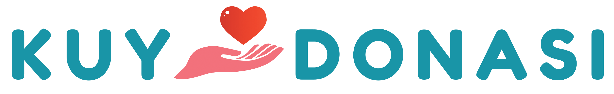
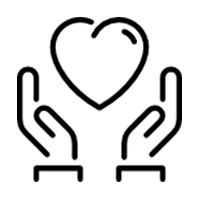
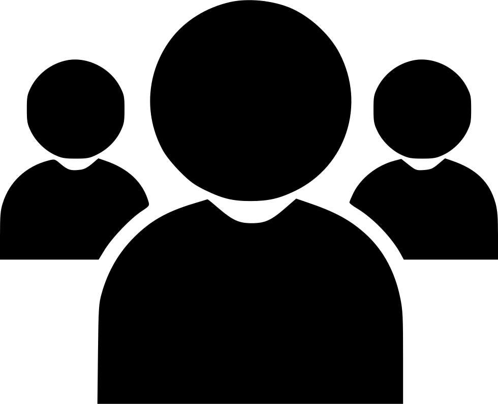
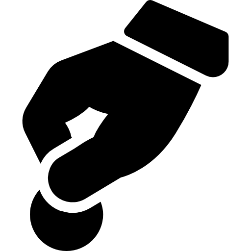
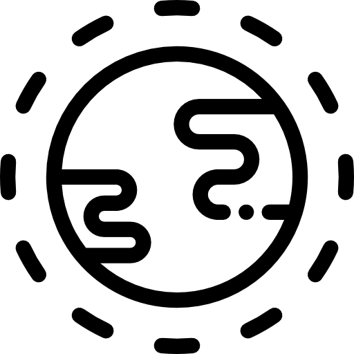
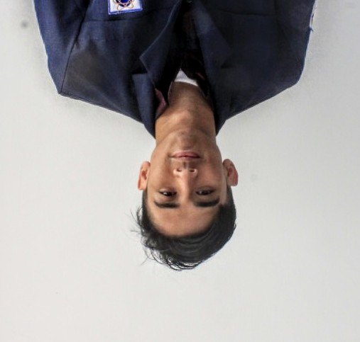
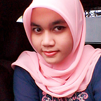
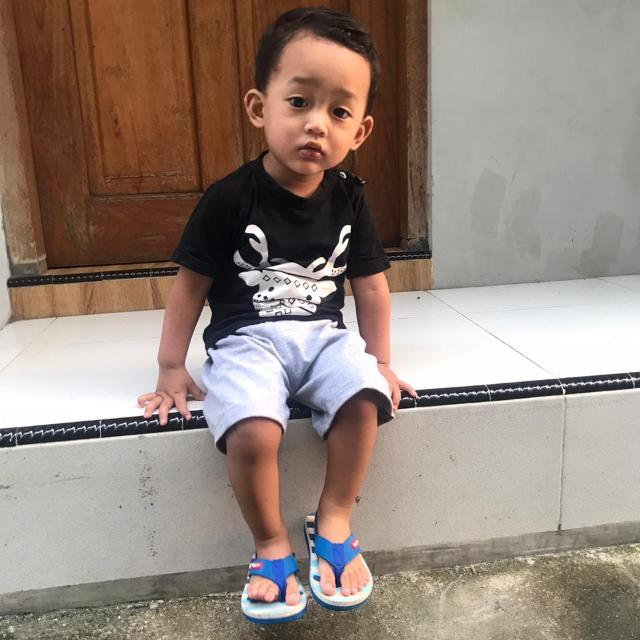

# kuydonasi
<!DOCTYPE html>
<html>
<head>
    <meta charset="utf-8">
    <meta name="viewport" content="width=device-width, initial-scale=1.0">
    <title>KuyDonasi- Tempat berkumpulnya insan yang dermawan</title>
    <link rel="stylesheet" href="css/home-style.css">
    <link rel="stylesheet" href="css/home-responsive.css">
    <link rel="stylesheet" href="https://cdnjs.cloudflare.com/ajax/libs/font-awesome/4.7.0/css/font-awesome.min.css">
</head>
<body>
	<!-- Open NAVBAR -->
    

        

          

          

            <a href="#">News</a>
            <a href="#">Contact</a>
            <a href="#">About</a>
          

          <a href="javascript:void(0);" class="icon" onclick="myFunction()">
            <i class="fa fa-bars"></i>
          </a>
        

      

    <!-- Jumbotron -->
    

        

            <h1>SEDEKAH, PEDULI, DINAMIS, BERKAH.</h1>
            <h1>BERBAGI DENGAN CARA MODERN DAN LEBIH MUDAH</h1>
            
Berbagi itu tidak mengenal umur, usia, ras, agama dan jabatan

            
#YUKITABERBAGI

            

                <button class="button-hover">
                    Registrasi
                </button>
                <button class="button-hover">
                    Login
                </button>

            

        

    

    

	<!-- Main Services -->
	

        

            <h2>Kami Membutuhkan Anda<h2>
                

                    Kuy Donasi yang memiliki tujuan untuk memberikan bantuan kemanusiaan dalam keadaan darurat dan memberikan pelayanan sosial dan kesehatan masyarakat, membutuhkan bantuan anda untuk dapat memberikan pelayanan yang maksimal. Kami memiliki berbagai program Donasi untuk dapat anda pilih dibawah ini. Klik tombol Beri Donasi untuk melihat penjelasan setiap program.
                

        

        

        

            

                
                <h3>Kuy Siaga Pandemi</h3>
            

                

                    
<b>Kuy Donasi Siaga Pandemi</b> adalah sebuah program penggalangan dana untuk membantu kegiatan sosialisasi siaga pandemi di masyarakat, kondisi KLB (Kejadian Luar Biasa), dan atau pandemi di Indonesia.

                    <a href="#" class="card-btn">Read more</a>
                

        

        

            

                
                <h3>Kuy Donasi Program</h3>
            

                

                    
<b>Kuy Donasi Program</b> adalah upaya penggalangan dana dari masyarakat (individu, lembaga/institusi/komunitas dan perusahaan)
                        untuk dialokasikan ke berbagai program seperti tanah longsor, banjir dll.
                    

                    <a href="#" class="card-btn">Read more</a>
                

        

        

            

                
                <h3>Kuy Donasi Khusus</h3>
            

                

                    
<b>Kuy Donasi Umum</b> adalah wadah yang digunakan untuk mempermudah masyarakat dalam berdonasi. Siapapun dapat berpartisipasi dalam kegiatan Kuy Donasi dalam pengalangan dana online tersebut.
                    

                    <a href="#" class="card-btn">Read more</a>
                

        

        

            

                
                <h3>Kuy Donasi Umum</h3>
            

                

                    
<b>Kuy Donasi Khusus</b> adalah sebuah program donasi yang bersifat temporer donasi yang dilaksanakan dalam tenggat waktu tertentu disesuaikan dengan kebutuhan penanganan korban di lokasi tertentu.
                    

                    <a href="#" class="card-btn">Read more</a>
                

        

        

    

    <!-- Member -->
	

      

      	

           <h2>Our Team</h2>
           <h3>J04 Honorary Member</h3>
        

		

			

				
			

			

				<h3>Aditya Roihansyah Jobdesk: Header</h3>
			

		

		

			

				
			

			

				<h3>Dindin Abduloh Jobdesk: Main I (About)</h3>
			

		

		

			

				
			

			

				<h3>Mohamad Iman Solihin Sudrajat Jobdesk: Main II (Services)</h3>
			

		

		

			

				
			

			

				<h3>Alifia Kanya Dibya Jobdesk: Main III (Team)</h3>
			

		

		

			

				
			

			

				<h3>Arif Abdurohim Jobdesk: Footer</h3>
			

		

	  

	

	<!-- footer -->
    <footer>
      

        <h3>Kepoin Sosial Media Kita</h3>
        

        	<a href="#" class="footer-btn facebook"> &nbspFacebook</a>
        	<a href="#" class="footer-btn instagram">  &nbspInstagram</a>
        	<a href="#" class="footer-btn twitter">  &nbspTwitter</a>
        	<a href="#" class="footer-btn whatsapp"> &nbspWhatsApp</a>
        

        
Copyright 2020 | Kuy Donasi

      

    </footer>
</body>

